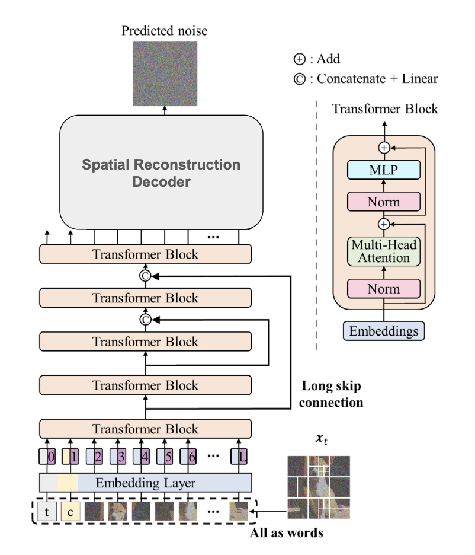

# APT-DiT: A Fully Transformer-Based LDM with Adaptive Patching
### 10-423/623 Generative AI Course Project

**Authors:** Yu Chien Hou, Anthony Lin, Joanne Pon  
**Carnegie Mellon University**

<p align="center">
  
</p>

## Abstract
State-of-the-art Latent Diffusion Models (LDMs) typically rely on "uniform compute," processing blank backgrounds with the same computational cost as detailed foregrounds. We propose **APT-DiT**, a novel architecture that integrates **Adaptive Patch Transformer (APT)** methods into a **U-ViT** diffusion backbone. 

By dynamically pruning up to **40% of redundant tokens** based on image entropy, we shift the paradigm to **"content-aware generation."** Crucially, we introduce a novel **Spatial Reconstruction Decoder** that solves the "Generative Gap," allowing variable-length token sequences to be perfectly reconstructed into coherent images for pixel-space diffusion training.

## Key Innovations

### 1. Generative Adaptive Patching
Unlike standard DiTs that slice images into a rigid grid, our model uses an **Entropy Tokenizer** to analyze local image complexity.
* **High Entropy (Eyes, Edges):** Retained as fine-grained $16 \times 16$ patches.
* **Low Entropy (Sky, Walls):** Merged into coarse $32 \times 32$ or $64 \times 64$ patches.
* **Result:** The Transformer backbone processes significantly fewer tokens, focusing compute power solely on semantic details.

### 2. Spatial Reconstruction Decoder (The Novelty)
Standard adaptive patching is discriminative (outputting labels). To enable **generation**, we engineered a specialized decoder in `uvit_apt.py`:
* **Multi-Head Decoding:** Learned linear projection heads for each patch scale.
* **Vectorized Scatter:** A mechanism that uses preserved entropy masks to "paint" variable tokens back onto their exact $(x, y)$ coordinates in the pixel grid, filling the holes to form a complete image for loss calculation.

## Results (CIFAR-10)

We benchmarked our model against a standard U-ViT baseline. Despite processing fewer tokens, APT-DiT demonstrated superior convergence quality in early training stages.

| Model | Token Strategy | Training Steps | **FID Score** (Lower is better) |
| :--- | :--- | :--- | :--- |
| **Baseline U-ViT** | Fixed Grid (100% Tokens) | 50,000 | 43.48 |
| **APT-DiT (Ours)** | **Adaptive (Variable Tokens)** | 50,000 | **20.39** |

*Our APT model achieved a **~2x improvement in FID** compared to the baseline at the same training step, validating that focusing compute on high-entropy regions serves as a strong architectural prior for image generation.*

## CelebA ($64 \times 64$)
We further evaluated the model on facial generation to test performance at higher resolutions.

| Model | Token Strategy | **FID Score** (Lower is better) |
| :--- | :--- | :--- |
| **Baseline U-ViT** | Fixed Grid (100% Tokens) | **44.1** |
| **APT-DiT (Ours)** | Adaptive (Variable Tokens) | 198.2 |

*Analysis: While the model converged successfully on color and global structure, the CelebA experiments revealed a specific limitation we term the **"Smoothness Trap."** The entropy tokenizer often misclassified smooth features (like skin and cheeks) as low-information background, merging them into large patches. This caused texture artifacts in facial regions, increasing the FID score despite the efficiency gains.*

## Installation

```bash
# Clone the repo
git clone [https://github.com/your-username/APT-DiT.git](https://github.com/your-username/APT-DiT.git)
cd APT-DiT

# Install dependencies
pip install torch torchvision --extra-index-url [https://download.pytorch.org/whl/cu116](https://download.pytorch.org/whl/cu116)
pip install accelerate absl-py ml_collections einops wandb ftfy transformers

# Optional but recommended for speed
pip install xformers
```

## Usage
### 1. Training
We use accelerate for distributed training. To train the APT-DiT model on CIFAR-10:
```bash
accelerate launch --multi_gpu --mixed_precision fp16 train.py --config=configs/cifar10_uvit_apt.py
```
Note: Ensure your config file selects the UViT_APT model class.

### 2. Evaluation (FID Calculation)
To generate samples and calculate FID scores using the saved checkpoints:

```bash
accelerate launch --mixed_precision fp16 eval.py --config=configs/cifar10_uvit_apt.py --nnet_path=workdir/cifar10_uvit_apt/default/ckpts/50000.ckpt
```

## Code Structure
- **libs/uvit_apt.py**: Contains the UViT_APT class and the novel reconstruct_image decoder logic.

- **libs/apt_utils.py**: Implements PatchTokenizer (entropy calculation) and TokenizedZeroConvPatchAttn (multi-scale embedding).

- **libs/uvit.py**: The baseline U-ViT implementation for comparison.

- **train.py**: Main training loop with WandB logging and SDE sampling.

## Theory vs. Practice
- **Why is training on CIFAR-10 slower per iteration?** On small images ($32 \times 32$), the overhead of calculating entropy maps and scattering tokens outweighs the compute saved by reducing the sequence length.
- **Where is the speedup?** The efficiency gains of APT scale quadratically. On high-resolution images ($256 \times 256$ or $512 \times 512$), the reduction in $N$ tokens leads to massive $O(N^2)$ savings in attention, theoretically speeding up training by 30-50%.

## Acknowledgements
This project builds upon:
1.  **U-ViT:** *All are Worth Words: A ViT Backbone for Diffusion Models* (Bao et al., CVPR 2023).
2.  **APT:** *Accelerating Vision Transformers with Adaptive Patch Sizes* (Choudhury et al., arXiv 2025).
